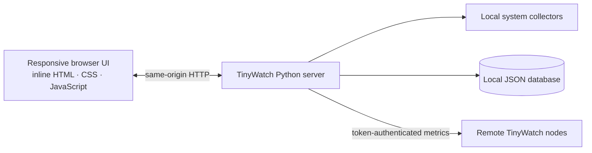

<div align="center">

# ◈ TinyWatch

### A clear, lightweight window into your infrastructure.

**One Python file. Zero third-party packages. A live dashboard for the machines you care about.**

[](https://www.python.org/)
[](https://github.com/b23r0/TinyWatch/actions/workflows/ci.yml)
[](#-quick-start)
[](#-what-it-monitors)
[](LICENSE)

[English](#-quick-start) · [简体中文](#zh-cn) · [Features](#-what-it-monitors) · [Remote assets](#-connect-remote-assets) · [Security](#-security--privacy) · [API](#-built-in-api)

</div>

TinyWatch is a self-hosted monitoring console for small servers, home labs, and personal infrastructure. It serves its own responsive web UI from a single Python file, collects metrics with Python’s standard library and available native system interfaces, and stores dashboard settings and historical samples in a local JSON database.

> **中文简介**：TinyWatch 是一个单文件、零第三方依赖的轻量级主机监控面板，支持多主机资产、历史曲线、深浅主题和六种界面语言。

## ✨ What it monitors

| Monitor | What you can see |
| --- | --- |
| **CPU** | Overall utilization and per-core readings where the operating system exposes counters |
| **Memory** | Used, available, total, and utilization percentage |
| **Storage** | Disk usage and a per-drive / per-partition detail view |
| **Network** | Receive and transmit rates, totals, and selectable interfaces |
| **System load** | Load averages where available; a CPU-based reference on Windows |
| **Processes** | CPU, memory, process state, and best-effort network activity |
| **Sign-in events** | SSH and remote desktop events when the OS log and current permissions allow access |
| **DNS** | System DNS cache entries where available, with a hosts-file fallback on some systems |
| **Host profile** | Host name, processor, memory, OS and kernel versions, uptime, and current sessions |
| **History** | Local samples, date/time range selection, tiered extreme-point retention, visible gaps, and keyboard/touch inspection |
| **Alerts** | Persistent threshold and historical-baseline rules, acknowledgement, recovery, cooldown, and incident context |
| **Asset health** | Online, stale, partial, and healthy states with per-collector diagnostics |

The dashboard refreshes live metrics every **2.5 seconds**. A server-side sampler writes historical samples every **60 seconds**, even while the dashboard is closed. Browser refreshes reuse a short-lived cluster snapshot, and each remote asset reports when its metrics were last collected successfully. Charts preserve short peaks when reducing large histories, show gaps when collection pauses, and expose a crosshair with keyboard and touch inspection.

## 🧭 A small architecture, by design



The UI has no CDN, framework, font, or stylesheet dependency. The app is one `tinywatch.py` file; the only runtime requirement is Python 3.

## 🚀 Quick start

### 1. Get TinyWatch

```bash
git clone https://github.com/b23r0/TinyWatch.git
cd TinyWatch
```

### 2. Start the server

**Linux / macOS / Unix**

```bash
python3 tinywatch.py
```

**Windows**

```powershell
py -3 tinywatch.py
```

Open **http://127.0.0.1:8765/** in a browser. On first launch, TinyWatch prints a one-time setup code in the server terminal. Enter that code and create an administrator password (at least 10 characters). The code is discarded after setup or when the server stops. No `pip install`, build step, or external frontend download is required.

### 3. Make it yours

- Arrange the dashboard cards by dragging them; add the metrics and hosts you want to see.
- Switch between dark and light themes, or choose English, 简体中文, 日本語, Français, Русский, or Deutsch.
- Choose a preset history window or enter an exact start and end date/time.
- Set local history retention to **1, 3, 7, 14, or 30 days**. The default is 7 days; reducing it immediately prunes older samples.

## 🔔 Explainable alerts and asset health

Open **Alerts** above the monitoring cards to review incidents and edit rules. The initial rules monitor all configured nodes: CPU and memory above 90% for 3 minutes, disk above 90% for 5 minutes, and an unreachable node for 2 minutes. Resource alerts recover at 85%; a recovered rule has a 5-minute cooldown. Rules support CPU, memory, disk, total network bandwidth in bytes/second, system load, offline status, and stale sample age in seconds.

- **Fixed thresholds** use separate trigger and recovery values to avoid flapping.
- **Historical baselines** use the preceding 24 hours, excluding the latest 10 minutes, and require at least 30 valid samples. The trigger is `median + max(minimum increase, 3 × 1.4826 × MAD)`. Recovery uses 70% of that increase. The baseline is frozen while an incident is active so a sustained anomaly cannot become its own normal.
- **Persistent incidents** survive restarts and are deduplicated per rule and asset. Acknowledging an incident keeps it active until recovery. Missing or failed measurements cannot resolve it; a collection pause resets an untriggered rule's pending duration. Editing a rule closes its old incident with a distinct reason.
- **Trigger context** includes up to three processes by CPU usage, recent readable login records, DNS entry count/source, and collection errors. These are observations near the trigger, not proof of a root cause. DNS entries and general event logs are not archived continuously.

Rules are evaluated by the background minute sampler, even without a browser. Timings are quantized to that interval; brief activity between samples may be missed. Up to 32 rules and 1,024 incidents are retained. Closed incidents follow the history retention window and may be evicted earlier at the incident limit; active incidents are preserved. Alerts are local to the dashboard, with no external notification service.

The **Asset health** strip opens diagnostics for each node. **Healthy** means fresh data with available collectors; **partial** means collection errors or unsupported collectors; **stale** means no usable timestamp or a sample older than 120 seconds; **offline** means the request failed. Node clock differences can affect freshness, and are shown when a timestamp is far in the future. Diagnostics distinguish an unsupported metric from an actual collection failure.

## 📈 History that stays lightweight

The JSON database remains a single local file with atomic replacement and one backup. Its encoding is compact, and history maintenance runs at startup and approximately hourly:

| Sample age | Retention within each time bucket |
| --- | --- |
| Recent 24 hours | Original one-minute samples |
| 24 hours through 7 days | First, last, minimum and maximum observations per 5-minute bucket |
| Older than 7 days | First, last, minimum and maximum observations per hourly bucket |

Retained points keep their real timestamps and measured values. Network retention preserves extrema for each interface and direction. Collection gaps are tracked explicitly through compaction and chart downsampling. Older history is therefore sparse, and cannot reconstruct every minute or the exact duration of an old peak. Queries return at most 1,200 points with corresponding `gaps` flags; the browser reduces them further for display. Existing schema-1 databases are read automatically and compacted on startup. Storage still loads the retained JSON into memory and rewrites it on each save; it is intended for a small fleet, currently up to 16 remote assets and 32 cards.

## 🌐 Connect remote assets

Every TinyWatch instance can report its own metrics to a central dashboard. Remote metrics use a per-instance agent token; no agent package or third-party service is needed.

1. Start TinyWatch on each host that should be monitored. Configure its port and listen address so the central host can reach it.
2. Sign in to that host and open **Assets** to copy its agent token.
3. On the central dashboard, open **Assets** and add a name, an address such as `192.168.1.10:8765`, and that host’s token. Bare addresses use HTTP; an explicit HTTPS URL is also supported.
4. Add cards for the new asset and choose the metrics you want on your dashboard.

The central server requests `GET /api/agent/metrics` from each remote host and sends the token in the `X-TinyWatch-Token` header. Credentials stay simple: one shared token per node, with no accounts, rotation workflow, or certificate setup required for LAN use. HTTP sends that token without encryption and is intended for trusted networks. If you choose HTTPS, certificates are verified. Redirects are refused so the token is not forwarded to another host. A node can be monitored by more than one dashboard, and each dashboard stores its own history locally.

## 🛠 Configuration

| Option | Default | Description |
| --- | --- | --- |
| `--host` | `127.0.0.1` | Address to listen on. Use `0.0.0.0` only when remote access is intended and firewalled. |
| `--port` | `8765` | HTTP listening port. |
| `--data` | `~/.tinywatch/data.json` | Path to the local JSON database. |
| `--secure-cookie` | Off | Add the `Secure` flag to session cookies when a trusted reverse proxy serves TinyWatch over HTTPS. |
| `--version` | — | Print the TinyWatch version and exit. |

Examples:

```bash
# Choose another port and database file
python3 tinywatch.py --port 9000 --data ./tinywatch-data.json

# Listen on a LAN interface for remote asset monitoring
python3 tinywatch.py --host 0.0.0.0 --port 8765
```

The data path can also be set with the `TINYWATCH_DATA` environment variable. Command-line `--data` takes precedence. When terminating TLS at a trusted reverse proxy, run TinyWatch with `--secure-cookie` and keep the backend bound to localhost.

## 🔐 Security & privacy

- TinyWatch binds to **localhost by default**. First-time password setup requires a random one-time code printed to the server terminal; it is never returned by the API and is invalidated after setup or restart. This also protects setup when a same-host reverse proxy makes remote clients appear to originate from loopback.
- Administrator passwords are stored as salted **PBKDF2-HMAC-SHA256** hashes, never as plaintext.
- The JSON database contains dashboard configuration, agent tokens, retained metric samples, and incident observations. Protect and back it up like other sensitive server configuration; file permissions are restricted where the operating system supports it.
- TinyWatch atomically replaces the JSON database and keeps one previous known-good copy at `<data-file>.bak`. Startup and retention changes prune expired history from both copies. If the primary file is damaged, it preserves the damaged copy as `<data-file>.corrupt-*`, restores the backup, and displays a recovery notice. If neither file is valid, startup stops without replacing either file.
- Remote agent tokens grant access to that node’s metrics. HTTP is supported on trusted networks and transmits the token without encryption; HTTPS verifies certificates, and redirects are not followed. Keep tokens private and rotate them if a database backup is exposed.
- The built-in server speaks HTTP. For access beyond a trusted local network, put it behind a trusted TLS reverse proxy, use `--secure-cookie`, and apply firewall rules. Do not expose the service directly to the public internet. TinyWatch does not trust forwarded client-address headers; reverse proxies should enforce their own login rate limits because backend rate limiting sees the proxy address.
- Run only one TinyWatch process against a given JSON database file. The file is protected against interrupted single-process writes; it is not a multi-process database.

## 🖥 Platform notes

TinyWatch supports Windows, Linux, macOS, and other Unix-like systems, using native counters or standard system interfaces where available. Some details depend on the host:

- Per-process network rates are best-effort and currently rely on Linux `ss` socket counters when available and permitted; other systems may show socket counts or no per-process network rate.
- SSH / RDP sign-in logs and DNS cache contents are restricted by OS permissions and by what the operating system exposes. An empty panel does not necessarily mean there were no events or DNS entries.
- Windows has no Unix load average; the dashboard shows a CPU-based reference value instead.
- Optional native utilities such as PowerShell, `ss`, `journalctl`, `who`, or `netstat` are used only where present. They are not Python package dependencies.

## 🔌 Built-in API

The dashboard uses a small same-origin HTTP API:

| Route | Purpose |
| --- | --- |
| `GET /api/status` | Check whether initial setup is required and whether the current session is authenticated |
| `POST /api/setup` | Set the first administrator password with the one-time setup code |
| `POST /api/login` / `POST /api/logout` | Start or end an administrator session |
| `GET /api/config` / `POST /api/config` | Read or update assets, dashboard widgets, theme, and history retention |
| `GET /api/metrics` | Read current metrics for the local host and configured assets; requires a session |
| `GET /api/history` | Read retained samples with gap flags; responses are capped at 1,200 points, preserving extrema |
| `GET /api/alerts` / `POST /api/alerts` | Read incidents/rules, save rules, or acknowledge an incident; requires a session |
| `GET /api/diagnostics` | Read asset freshness, collection latency, collector failures and capability gaps; requires a session |
| `GET /api/agent/metrics` | Read this node’s metrics with a valid `X-TinyWatch-Token` header |

Example history query:

```text
/api/history?node=local&metric=cpu&range=24h
```

Supported preset ranges are `1h`, `6h`, `24h`, `3d`, `7d`, `14d`, and `30d`, subject to the configured retention. Use `range=custom` with Unix timestamp `start` and `end` parameters for an exact interval.

## 🧰 Development

TinyWatch has no runtime package dependencies. The cross-platform CI checks Python syntax, runs the standard-library regression suite, and parses the embedded UI JavaScript on Linux, Windows, and macOS. Node.js is used only by this development check, never by the running application. See [CONTRIBUTING.md](CONTRIBUTING.md) for local commands and change guidelines, and [SECURITY.md](SECURITY.md) for private vulnerability reporting.

## 📄 License

TinyWatch is released under the [MIT License](LICENSE).

<div align="center">

**Keep an eye on the essentials.**

</div>

---

<a id="zh-cn"></a>

## TinyWatch（简体中文）

TinyWatch 是一款轻量、自托管的服务器监控面板：**单个 Python 文件、零第三方 Python 依赖、界面资源全部内置**。适合个人服务器、家庭实验室和小型基础设施。

### 功能一览

- **实时主机监控**：CPU 总体及各核心占用、内存、磁盘和分区、网络上下行与网卡选择、系统负载。
- **系统信息**：处理器、内存、操作系统和内核版本、开机时长、当前会话。
- **进程与事件**：进程 CPU/内存占用；尽可能读取 SSH/RDP 登录事件和 DNS 缓存。
- **历史曲线**：服务端后台每分钟将指标保存到本地 JSON 数据库，关闭仪表盘后仍持续采样；图表可按预设范围或自定义日期时间查询，抽样时保留峰值，采集间断处显示断点，并支持触屏、鼠标和键盘查看。
- **分布式资产**：通过主机地址、端口和代理令牌汇总多台 TinyWatch 节点，可为不同资产添加不同监控卡片。
- **个性化界面**：拖拽排列面板、深浅主题、英语/简体中文/日语/法语/俄语/德语，以及适配移动端的布局。

数据刷新失败或延迟时，面板会显示状态提示。历史时间刻度按浏览器本地时区展示，跨年范围会显示年份。

指标每 **2.5 秒**刷新一次；历史数据默认保留 **7 天**，可设置为 1、3、7、14 或 30 天。缩短期限会立即清理更早的样本。

### 告警、事件时间线和资产健康

在监控面板上方打开 **告警**。默认规则覆盖所有资产：CPU/内存超过 90% 持续 3 分钟、磁盘超过 90% 持续 5 分钟、节点离线持续 2 分钟。资源告警在降到 85% 时恢复，恢复后冷却 5 分钟。支持最多 32 条规则，可以按资产设置 CPU、内存、磁盘、总网络带宽（B/s）、系统负载、离线和样本过期时间（秒）的条件。

历史基线模式使用过去 24 小时的中位数和 MAD，排除最近 10 分钟，至少需要 30 个有效样本。触发值为 `中位数 + max(最小增量, 3 × 1.4826 × MAD)`，恢复值使用增量的 70%；告警期间冻结基线，避免持续异常被当成正常。

事件会在重启后保留，同一规则和资产的持续异常只形成一个事件。确认告警不会停止监控；缺失或失败的指标不会被当成恢复。事件详情记录触发时 CPU 占用较高的三个进程、可读的近期登录记录、DNS 条目数/来源和采集错误，供排查参考，不能据此认定故障原因。不会持续归档 DNS 条目或全部系统事件。规则按分钟评估，可能错过两次采样之间的短暂变化；告警仅在本地面板展示。

已结束事件按数据保留期限清理；最多保留 1,024 个事件，达到容量时会提前清理较早的已结束事件，正在告警的事件会保留。

**资产健康** 一栏可打开各节点的采集诊断：区分正常、部分指标不可用、数据过期和离线，并展示采集耗时、最后成功时间、系统接口限制和具体错误。没有有效时间戳或样本超过 120 秒会显示过期，节点时钟差也可能影响判断。

### 历史数据分层保留

保留最近约 24 小时的每分钟原始数据；第 2–7 天按 5 分钟保留首尾和极值，更早按小时保留首尾和极值，保留到配置的期限。网络数据保留各网卡、各方向的极值，保留下来的点仍是实际采样时间和值；断采标记会贯穿压缩和绘图。较早数据无法还原每一分钟的变化或峰值精确持续时间。

历史查询最多返回 1,200 个保留极值的点及对应的 `gaps` 标记。旧的 schema-1 数据库会自动读取并在启动时整理。数据库采用紧凑 JSON 编码，仍是一个本地文件，保留原子写入和备份恢复机制；仍需将历史加载到内存并在保存时重写，适用于目前最多 16 个远程资产和 32 张卡片的小型环境。

### 快速启动

```bash
git clone https://github.com/b23r0/TinyWatch.git
cd TinyWatch
python3 tinywatch.py
```

Windows 可运行：

```powershell
py -3 tinywatch.py
```

然后打开 [http://127.0.0.1:8765/](http://127.0.0.1:8765/)。首次启动时，TinyWatch 会在服务终端打印一次性设置代码；在页面输入代码并设置管理员密码（至少 10 个字符）。设置完成或服务重启后代码失效。不需要安装依赖、构建前端或下载 CDN 资源。

### 添加远程主机

1. 在每台远程主机启动 TinyWatch，并让中心主机能够访问该地址和端口。
2. 登录远程主机，打开侧栏的 **资产** 菜单，复制该主机的代理令牌。
3. 在中心面板的 **资产** 菜单中填写资产名称、地址（例如 `192.168.1.10:8765`）和刚复制的令牌。直接填写 IP:端口 会使用 HTTP，也可以填写 HTTPS 地址。
4. 为新资产添加监控卡片。

中心主机通过 `GET /api/agent/metrics` 读取远程指标，并在 `X-TinyWatch-Token` 请求头中提供令牌。每个节点只使用一个共享令牌，局域网部署不需要证书或额外的凭证管理。HTTP 会明文发送令牌，适用于可信网络；使用 HTTPS 时会验证证书。请求不会跟随重定向，避免把令牌转发给其他主机。各主机的历史数据保存在中心实例自己的本地数据库中。

### 配置

| 参数 | 默认值 | 说明 |
| --- | --- | --- |
| `--host` | `127.0.0.1` | 监听地址；只有需要远程访问时才使用 `0.0.0.0`，并配置防火墙。 |
| `--port` | `8765` | HTTP 服务端口。 |
| `--data` | `~/.tinywatch/data.json` | 本地 JSON 数据库路径。 |
| `--secure-cookie` | 关闭 | 通过可信反向代理使用 HTTPS 时，为会话 Cookie 添加 `Secure` 标志。 |
| `--version` | — | 显示版本后退出。 |

例如：`python3 tinywatch.py --port 9000 --data ./tinywatch-data.json`。也可以用 `TINYWATCH_DATA` 环境变量指定数据库路径；命令行 `--data` 优先级更高。由可信反向代理终止 TLS 时，使用 `--secure-cookie` 并让 TinyWatch 只监听 localhost。

### 安全与平台说明

- 服务默认只监听本机；首次设置需要服务终端打印的一次性代码。API 不会返回该代码，设置完成或重启后代码失效，因此同机反向代理不会因连接来源显示为回环地址而绕过首次设置保护。
- 密码以加盐 PBKDF2-HMAC-SHA256 哈希保存。JSON 数据库包含代理令牌、面板设置、历史指标和告警观测信息，请妥善保护和备份。
- 数据库通过临时文件和原子替换保存，并保留一个 `.bak` 上一版本。启动和修改保留期限时会同时清理主文件及备份中过期的历史数据。损坏时 TinyWatch 会保留 `.corrupt-*` 文件并从有效备份恢复；主文件和备份都无效时会停止启动，原文件不会被空库覆盖。
- 分布式资产支持 HTTP 和 HTTPS。HTTP 会明文发送共享令牌，适用于可信网络；HTTPS 会验证证书，所有请求均不会跟随重定向。
- 内置服务器使用 HTTP。需要在可信局域网外访问时，请通过可信的 TLS 反向代理并配置防火墙，不要将服务直接暴露到公网。反代部署时建议启用 `--secure-cookie`；TinyWatch 不信任转发头中的客户端地址，登录限流会看到代理地址，反向代理应另外配置限流。
- 同一个 JSON 数据库文件只应由一个 TinyWatch 进程使用；该格式提供单进程原子写入和恢复，不是多进程数据库。
- Windows、Linux、macOS 和其他 Unix 系统使用各自可用的系统接口读取指标。进程网络速率依赖 Linux 上可用且有权限的 `ss`；登录日志和 DNS 缓存受系统权限及平台接口限制。Windows 不提供 Unix load average，面板会显示 CPU 参考值。
- PowerShell、`ss`、`journalctl`、`who`、`netstat` 等系统命令仅在相关平台可用时尝试调用；它们不是 Python 第三方依赖。

TinyWatch 使用 [MIT License](LICENSE)。CI 会在 Linux、Windows 与 macOS 上检查 Python 语法、运行标准库回归测试并解析内嵌 JavaScript；Node.js 仅用于开发验证，不是应用运行依赖。详情见 [CONTRIBUTING.md](CONTRIBUTING.md) 和 [SECURITY.md](SECURITY.md)。
