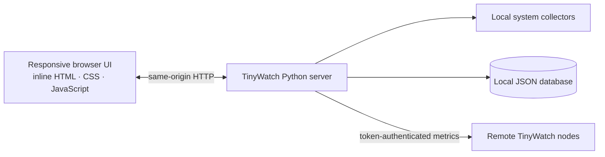

<div align="center">

# ◈ TinyWatch

### A clear, lightweight window into your infrastructure.

**One Python file. Zero third-party packages. A live dashboard for the machines you care about.**

[](https://www.python.org/)
[](#-quick-start)
[](#-what-it-monitors)
[](LICENSE)

[English](#-quick-start) · [简体中文](#zh-cn) · [Features](#-what-it-monitors) · [Remote assets](#-connect-remote-assets) · [Security](#-security--privacy) · [API](#-built-in-api)

</div>

TinyWatch is a self-hosted monitoring console for small servers, home labs, and personal infrastructure. It serves its own responsive web UI from a single Python file, collects metrics with Python’s standard library and available native system interfaces, and stores dashboard settings and historical samples in a local JSON database.

> **中文简介**：TinyWatch 是一个单文件、零第三方依赖的轻量级主机监控面板，支持多主机资产、历史曲线、深浅主题和六种界面语言。

## ✨ What it monitors

| Monitor | What you can see |
| --- | --- |
| **CPU** | Overall utilization and per-core readings where the operating system exposes counters |
| **Memory** | Used, available, total, and utilization percentage |
| **Storage** | Disk usage and a per-drive / per-partition detail view |
| **Network** | Receive and transmit rates, totals, and selectable interfaces |
| **System load** | Load averages where available; a CPU-based reference on Windows |
| **Processes** | CPU, memory, process state, and best-effort network activity |
| **Sign-in events** | SSH and remote desktop events when the OS log and current permissions allow access |
| **DNS** | System DNS cache entries where available, with a hosts-file fallback on some systems |
| **Host profile** | Host name, processor, memory, OS and kernel versions, uptime, and current sessions |
| **History** | Local one-minute samples with date/time range selection and chart hover details |

The dashboard refreshes live metrics every **2.5 seconds**. Historical samples are written every **60 seconds**. Hover over a chart to inspect the sample time and value; network charts also show receive and transmit rates.

## 🧭 A small architecture, by design



The UI has no CDN, framework, font, or stylesheet dependency. The app is one `tinywatch.py` file; the only runtime requirement is Python 3.

## 🚀 Quick start

### 1. Get TinyWatch

```bash
git clone https://github.com/b23r0/TinyWatch.git
cd TinyWatch
```

### 2. Start the server

**Linux / macOS / Unix**

```bash
python3 tinywatch.py
```

**Windows**

```powershell
py -3 tinywatch.py
```

Open **http://127.0.0.1:8765/** in a browser. On first launch, create an administrator password (at least 10 characters). No `pip install`, build step, or external frontend download is required.

### 3. Make it yours

- Arrange the dashboard cards by dragging them; add the metrics and hosts you want to see.
- Switch between dark and light themes, or choose English, 简体中文, 日本語, Français, Русский, or Deutsch.
- Choose a preset history window or enter an exact start and end date/time.
- Set local history retention to **1, 3, 7, 14, or 30 days**. The default is 7 days; reducing it immediately prunes older samples.

## 🌐 Connect remote assets

Every TinyWatch instance can report its own metrics to a central dashboard. Remote metrics use a per-instance agent token; no agent package or third-party service is needed.

1. Start TinyWatch on each host that should be monitored. Configure its port and listen address so the central host can reach it.
2. Sign in to that host and open **Assets** to copy its agent token.
3. On the central dashboard, open **Assets** and add a name, the remote base URL (for example, `http://10.0.0.12:8765`), and that host’s token.
4. Add cards for the new asset and choose the metrics you want on your dashboard.

The central server requests `GET /api/agent/metrics` from each remote host and sends the token in the `X-TinyWatch-Token` header. A node can be monitored by more than one dashboard, and each dashboard stores its own history locally.

## 🛠 Configuration

| Option | Default | Description |
| --- | --- | --- |
| `--host` | `127.0.0.1` | Address to listen on. Use `0.0.0.0` only when remote access is intended and firewalled. |
| `--port` | `8765` | HTTP listening port. |
| `--data` | `~/.tinywatch/data.json` | Path to the local JSON database. |
| `--version` | — | Print the TinyWatch version and exit. |

Examples:

```bash
# Choose another port and database file
python3 tinywatch.py --port 9000 --data ./tinywatch-data.json

# Listen on a LAN interface for remote asset monitoring
python3 tinywatch.py --host 0.0.0.0 --port 8765
```

The data path can also be set with the `TINYWATCH_DATA` environment variable. Command-line `--data` takes precedence.

## 🔐 Security & privacy

- TinyWatch binds to **localhost by default**. First-time password setup is accepted only through localhost.
- Administrator passwords are stored as salted **PBKDF2-HMAC-SHA256** hashes, never as plaintext.
- The JSON database contains dashboard configuration, agent tokens, and retained metric samples. Protect and back it up like other sensitive server configuration; file permissions are restricted where the operating system supports it.
- Remote agent tokens grant access to that node’s metrics. Keep them private and use a trusted network path.
- The built-in server speaks HTTP. For access beyond a trusted local network, put it behind a trusted TLS reverse proxy and apply firewall rules. Do not expose the service directly to the public internet.

## 🖥 Platform notes

TinyWatch supports Windows, Linux, macOS, and other Unix-like systems, using native counters or standard system interfaces where available. Some details depend on the host:

- Per-process network rates are best-effort and currently rely on Linux `ss` socket counters when available and permitted; other systems may show socket counts or no per-process network rate.
- SSH / RDP sign-in logs and DNS cache contents are restricted by OS permissions and by what the operating system exposes. An empty panel does not necessarily mean there were no events or DNS entries.
- Windows has no Unix load average; the dashboard shows a CPU-based reference value instead.
- Optional native utilities such as PowerShell, `ss`, `journalctl`, `who`, or `netstat` are used only where present. They are not Python package dependencies.

## 🔌 Built-in API

The dashboard uses a small same-origin HTTP API:

| Route | Purpose |
| --- | --- |
| `GET /api/status` | Check whether initial setup is required and whether the current session is authenticated |
| `POST /api/setup` | Set the first administrator password; localhost only |
| `POST /api/login` / `POST /api/logout` | Start or end an administrator session |
| `GET /api/config` / `POST /api/config` | Read or update assets, dashboard widgets, theme, and history retention |
| `GET /api/metrics` | Read current metrics for the local host and configured assets; requires a session |
| `GET /api/history` | Read retained metric samples; requires a session |
| `GET /api/agent/metrics` | Read this node’s metrics with a valid `X-TinyWatch-Token` header |

Example history query:

```text
/api/history?node=local&metric=cpu&range=24h
```

Supported preset ranges are `1h`, `6h`, `24h`, `3d`, `7d`, `14d`, and `30d`, subject to the configured retention. Use `range=custom` with Unix timestamp `start` and `end` parameters for an exact interval.

## 📄 License

TinyWatch is released under the [MIT License](LICENSE).

<div align="center">

**Keep an eye on the essentials.**

</div>

---

<a id="zh-cn"></a>

## TinyWatch（简体中文）

TinyWatch 是一款轻量、自托管的服务器监控面板：**单个 Python 文件、零第三方 Python 依赖、界面资源全部内置**。适合个人服务器、家庭实验室和小型基础设施。

### 功能一览

- **实时主机监控**：CPU 总体及各核心占用、内存、磁盘和分区、网络上下行与网卡选择、系统负载。
- **系统信息**：处理器、内存、操作系统和内核版本、开机时长、当前会话。
- **进程与事件**：进程 CPU/内存占用；尽可能读取 SSH/RDP 登录事件和 DNS 缓存。
- **历史曲线**：每分钟将指标保存到本地 JSON 数据库，可按预设范围或自定义日期时间查询；悬停图表可查看时间和数值。
- **分布式资产**：通过主机地址、端口和代理令牌汇总多台 TinyWatch 节点，可为不同资产添加不同监控卡片。
- **个性化界面**：拖拽排列面板、深浅主题、英语/简体中文/日语/法语/俄语/德语，以及适配移动端的布局。

指标每 **2.5 秒**刷新一次；历史数据默认保留 **7 天**，可设置为 1、3、7、14 或 30 天。缩短期限会立即清理更早的样本。

### 快速启动

```bash
git clone https://github.com/b23r0/TinyWatch.git
cd TinyWatch
python3 tinywatch.py
```

Windows 可运行：

```powershell
py -3 tinywatch.py
```

然后打开 [http://127.0.0.1:8765/](http://127.0.0.1:8765/)。首次启动时设置管理员密码（至少 10 个字符）。不需要安装依赖、构建前端或下载 CDN 资源。

### 添加远程主机

1. 在每台远程主机启动 TinyWatch，并让中心主机能够访问该地址和端口。
2. 登录远程主机，打开侧栏的 **资产** 菜单，复制该主机的代理令牌。
3. 在中心面板的 **资产** 菜单中填写资产名称、远程基础地址（例如 `http://10.0.0.12:8765`）和刚复制的令牌。
4. 为新资产添加监控卡片。

中心主机通过 `GET /api/agent/metrics` 读取远程指标，并在 `X-TinyWatch-Token` 请求头中提供令牌。各主机的历史数据保存在中心实例自己的本地数据库中。

### 配置

| 参数 | 默认值 | 说明 |
| --- | --- | --- |
| `--host` | `127.0.0.1` | 监听地址；只有需要远程访问时才使用 `0.0.0.0`，并配置防火墙。 |
| `--port` | `8765` | HTTP 服务端口。 |
| `--data` | `~/.tinywatch/data.json` | 本地 JSON 数据库路径。 |
| `--version` | — | 显示版本后退出。 |

例如：`python3 tinywatch.py --port 9000 --data ./tinywatch-data.json`。也可以用 `TINYWATCH_DATA` 环境变量指定数据库路径；命令行 `--data` 优先级更高。

### 安全与平台说明

- 服务默认只监听本机；首次设置密码也必须通过 localhost。
- 密码以加盐 PBKDF2-HMAC-SHA256 哈希保存。JSON 数据库包含代理令牌、面板设置和历史指标，请妥善保护和备份。
- 内置服务器使用 HTTP。需要在可信局域网外访问时，请通过可信的 TLS 反向代理并配置防火墙，不要将服务直接暴露到公网。
- Windows、Linux、macOS 和其他 Unix 系统使用各自可用的系统接口读取指标。进程网络速率依赖 Linux 上可用且有权限的 `ss`；登录日志和 DNS 缓存受系统权限及平台接口限制。Windows 不提供 Unix load average，面板会显示 CPU 参考值。
- PowerShell、`ss`、`journalctl`、`who`、`netstat` 等系统命令仅在相关平台可用时尝试调用；它们不是 Python 第三方依赖。

TinyWatch 使用 [MIT License](LICENSE)。
